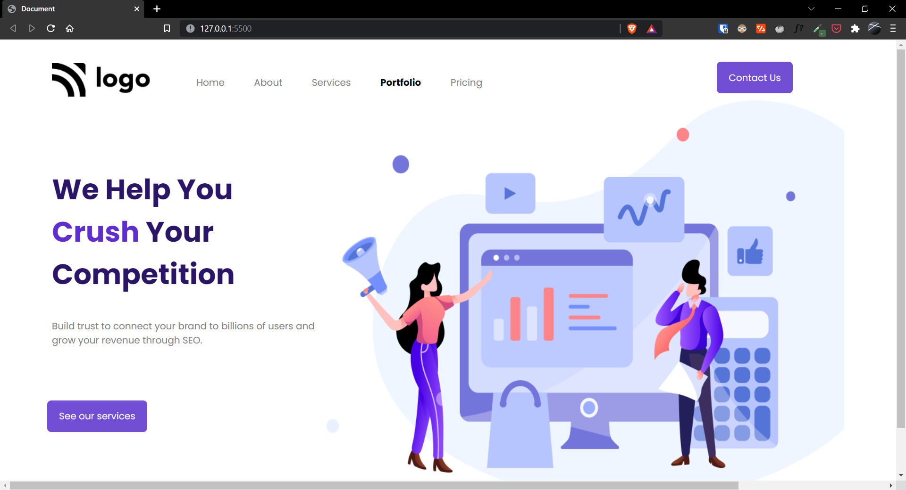

# Project-04 | Digital Marketing Homepage
Hi there,
I'm Wasit Ali and this is my 4th project on HTML and CSS in my [web dev bootcamp](https://ineuron.ai/course/Full-Stack-Javascript-Web-Developer). 

## ⚒️ Technologies Used
 - HTML
 - CSS

## 🖥 Preview

`note:` please make sure the preview screen is `1920 x 1080` and the site is not responsive as of now.

[Live Preview](https://guileless-cobbler-ea9cee.netlify.app/)

##  👀 What I have learned in this project?
- Target different images with required position property.
- Clear understanding of CSS positioning property.
- How to use background image with cover property.

## ⏲ Time to finish the project
It took me around 3 hours to get this done.